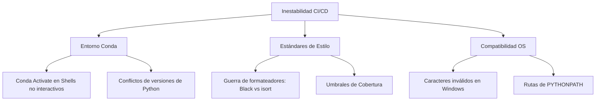

# 11a - Estabilización del Entorno CI/CD

## Contexto

Durante la jornada de trabajo centrada en la resolución de la Issue #32 y tareas relacionadas (#29, #30, #31, #36), nos enfrentamos a una serie de desafíos técnicos que impedían la ejecución fluida de las pruebas automatizadas. La estabilización del entorno de CI/CD se convirtió en el objetivo primordial para asegurar la integridad del código y facilitar el flujo de trabajo GitHub Flow.

## Hallazgos Principales

La estabilización reveló que la infraestructura de pruebas es tan crítica como el código funcional. Los problemas no eran fallos en la lógica de negocio, sino fricciones en la orquestación del entorno, la gestión de dependencias y la validación de estándares de estilo.

## Reflexiones Metodológicas

La experiencia subraya la importancia de la **Paridad de Entornos**. Un fallo que solo ocurre en el CI y no localmente es a menudo un síntoma de una configuración implícita o de una asunción sobre el sistema operativo. La creación de un archivo de configuración centralizado (`pyproject.toml`) y la alineación de los scripts de salud (`health-check.sh`) con la estructura real del proyecto fueron pasos decisivos para cerrar esta brecha.

## Conexiones

- [[11 - Sistema de Testing y Calidad]]
- [[11a1 - Desafíos de Conda en GitHub Actions]]
- [[11a2 - Gestión de Conflictos de Formateo]]
- [[11a3 - Compatibilidad Multiplataforma y el Zettelkasten]]
