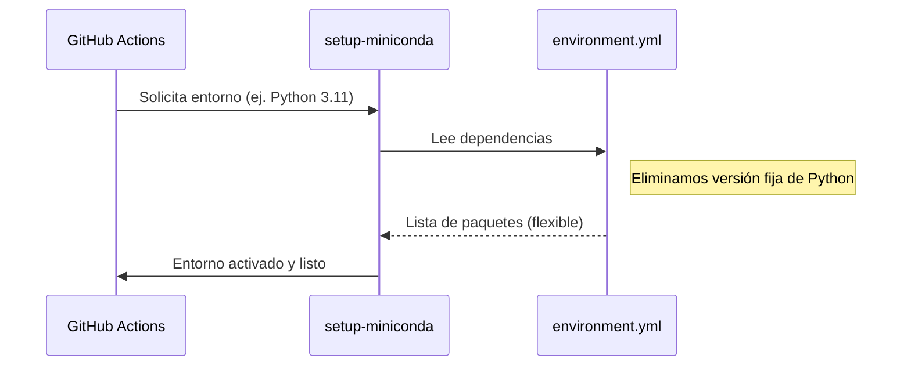

# 11a1 - Desafíos de Conda en GitHub Actions

## El Problema de la Activación

Uno de los mayores obstáculos fue la activación del entorno Conda en el entorno no interactivo de GitHub Actions. El comando `conda activate` requiere que el shell esté inicializado, lo cual no sucede por defecto en los runners de Ubuntu.

La solución técnica consistió en forzar el uso de un shell de login mediante `defaults.run.shell: bash -el {0}`. Esto asegura que los scripts de inicialización de Conda se ejecuten antes de cada paso del workflow, permitiendo que el entorno `gggit` esté disponible de manera consistente.

## Gestión Nativa vs. Manual

Inicialmente, el workflow intentaba crear y activar el entorno mediante comandos manuales de shell. Esta aproximación resultó frágil y propensa a errores de "PackagesNotFoundError" cuando las versiones de Python en la matriz del CI chocaban con las versiones fijas en el `environment.yml`.

Al delegar la creación del entorno a la acción oficial `conda-incubator/setup-miniconda@v3` y flexibilizar el archivo `environment.yml` (eliminando la versión fija de Python), logramos que la misma configuración funcione para múltiples versiones de Python en la matriz de pruebas.

## Conexiones

- [[11a - Estabilización del Entorno CI/CD]]
