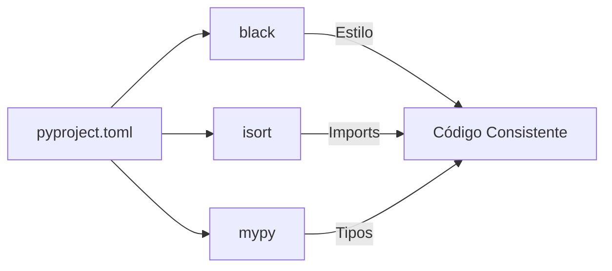

# 11a2 - Gestión de Conflictos de Formateo

## La "Guerra de Formateadores"

Un fenómeno interesante observado durante la estabilización fue el conflicto entre `black` e `isort`. Sin una configuración compartida, cada herramienta aplicaba sus propias reglas, lo que provocaba que una deshiciera los cambios de la otra. Esto se manifestaba en el CI como fallos alternantes entre el paso de formateo y el de ordenamiento de imports.

## Centralización con pyproject.toml

La solución definitiva no fue ajustar los comandos en el archivo `.yml`, sino introducir un archivo `pyproject.toml` en la raíz del proyecto. Este archivo actúa como la "única fuente de verdad" para todas las herramientas de calidad.

Al configurar `profile = "black"` dentro de la sección de `isort`, logramos que ambas herramientas hablen el mismo idioma. Esta centralización reduce la complejidad del workflow de CI y permite que los desarrolladores repliquen exactamente el mismo comportamiento en sus máquinas locales con un simple comando.

## Cobertura Progresiva

Finalmente, ajustamos el umbral de cobertura al 75%. Aunque el objetivo ideal es el 80%, la realidad del codebase actual (75.27%) sugería que un umbral demasiado estricto actuaría como un bloqueador en lugar de una guía. Esta decisión respeta la filosofía de Vibedoc de mejora continua y validación realista.

## Conexiones

- [[11a - Estabilización del Entorno CI/CD]]
