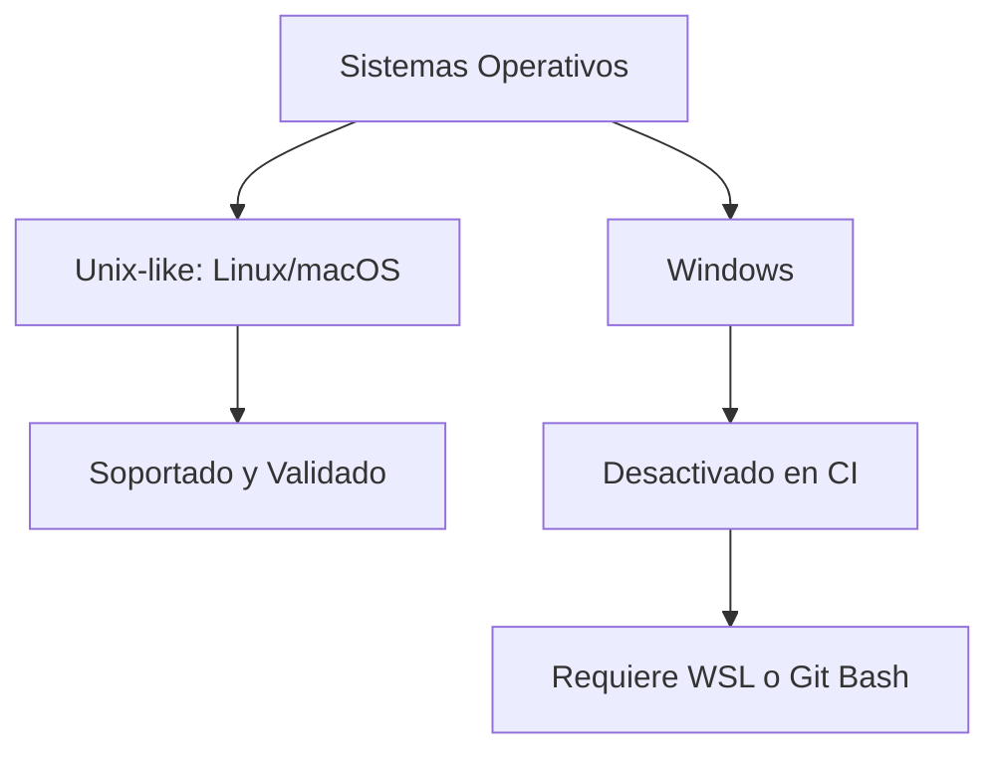

# 11a3 - Compatibilidad Multiplataforma y el Zettelkasten

## El Incidente de los Dos Puntos

Un hallazgo inesperado durante las pruebas en Windows fue el fallo del comando `git checkout`. El error `invalid path` se debía a que varios archivos en `.vibedoc/ideas/` utilizaban el carácter `:` (dos puntos) en su nombre. Mientras que Linux y macOS gestionan estos caracteres sin problemas, Windows los prohíbe en sus nombres de archivo.

Este incidente resalta una lección importante para proyectos de documentación distribuida: los nombres de los archivos son parte de la interfaz técnica y deben seguir reglas de compatibilidad universal.

## Decisión de Enfoque

Ante la complejidad de mantener un entorno de pruebas en Windows para un proyecto cuya naturaleza es profundamente Unix-like (basado en scripts de bash y alias), se tomó la decisión estratégica de desactivar temporalmente las pruebas en Windows.

Esta decisión permite concentrar los recursos del equipo en perfeccionar la experiencia en los sistemas donde ggGit es más nativo, sin renunciar a la compatibilidad futura mediante herramientas como WSL.

## Conexiones

- [[11a - Estabilización del Entorno CI/CD]]
