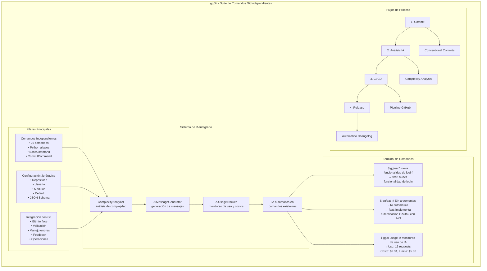
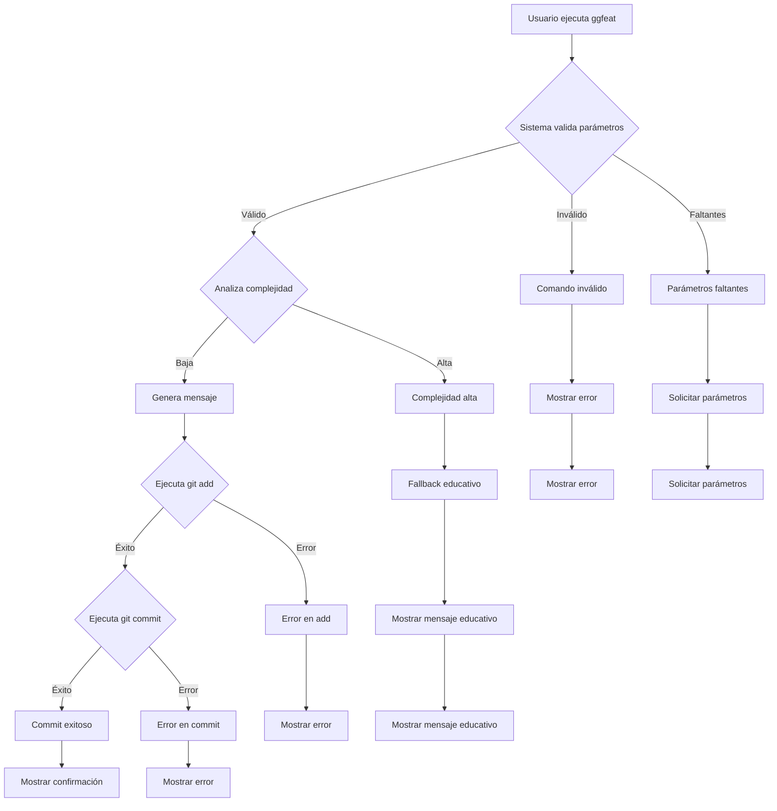
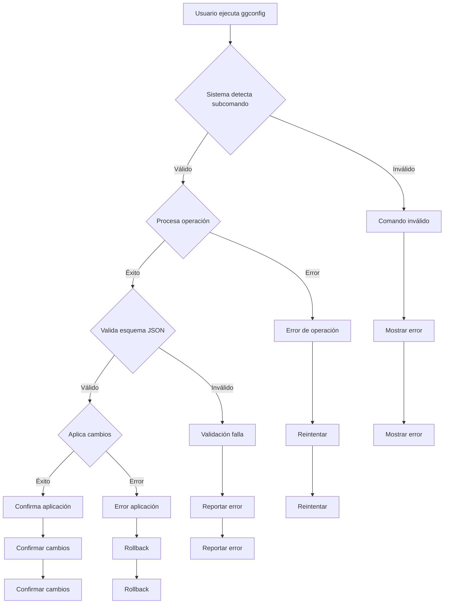
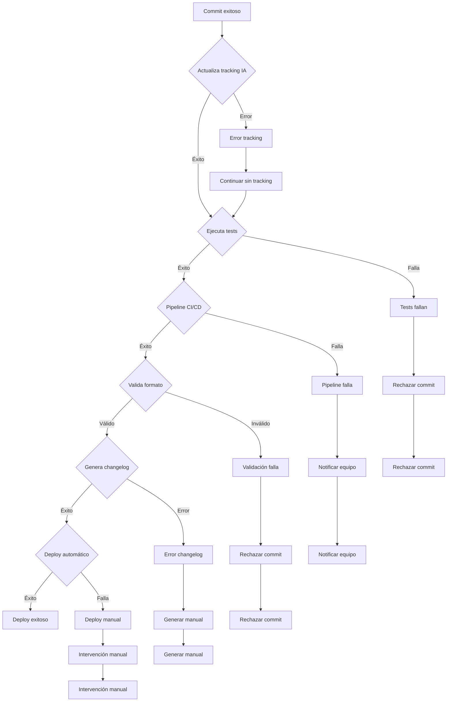

# [product-design] - ggGit <!-- omit in toc -->

> Este documento debe ser una continuación del documento [02-research-of-references-and-collections](02-research-of-references-and-collections.md). Consiste en la creación de un diseño de producto que resuelva el problema planteado en el documento [01-research-and-assessment-of-the-problem](01-research-and-assessment-of-the-problem.md).
> Se compone de una combinación de metodología lienzo canvas y sketch de producto funcionales con flujos bpmn simplificados.
> Permite generar ideas de solución y validar las propuestas de valor con los interesados.

## 📋 Tabla de Contenidos <!-- omit in toc -->

- [Descripción general](#descripción-general)
  - [Eventos y Actividades Clave](#eventos-y-actividades-clave)
  - [Explosión de Componentes](#explosión-de-componentes)
  - [Flexibilidad de Desarrollo por Comandos Independientes](#flexibilidad-de-desarrollo-por-comandos-independientes)
  - [Distribución de Vistas y Páginas](#distribución-de-vistas-y-páginas)
- [Glosario de términos y definiciones](#glosario-de-términos-y-definiciones)
- [Contexto: Terminal de Comandos](#contexto-terminal-de-comandos)
  - [Ciclo de vida](#ciclo-de-vida)
    - [Al iniciar el contexto](#al-iniciar-el-contexto)
    - [Al finalizar el contexto](#al-finalizar-el-contexto)
  - [Acciones](#acciones)
    - [Ejecutar comando ggGit](#ejecutar-comando-gggit)
      - [Descripción](#descripción)
      - [Beneficios](#beneficios)
      - [Casos de uso](#casos-de-uso)
        - [Desarrollador que necesita hacer un commit rápido](#desarrollador-que-necesita-hacer-un-commit-rápido)
        - [Tech Lead que quiere estandarizar commits del equipo](#tech-lead-que-quiere-estandarizar-commits-del-equipo)
    - [Configurar ggGit](#configurar-gggit)
      - [Descripción](#descripción-1)
      - [Beneficios](#beneficios-1)
      - [Casos de uso](#casos-de-uso-1)
        - [Nuevo desarrollador que se une al proyecto](#nuevo-desarrollador-que-se-une-al-proyecto)
        - [DevOps que necesita configurar el entorno](#devops-que-necesita-configurar-el-entorno)
    - [Gestionar configuración de módulos](#gestionar-configuración-de-módulos)
      - [Descripción](#descripción-2)
      - [Beneficios](#beneficios-2)
      - [Casos de uso](#casos-de-uso-2)
        - [Equipo que actualiza estándares de commit](#equipo-que-actualiza-estándares-de-commit)
        - [Integración con CI/CD pipeline](#integración-con-cicd-pipeline)
    - [Configurar repositorio específico](#configurar-repositorio-específico)
      - [Descripción](#descripción-3)
      - [Beneficios](#beneficios-3)
      - [Casos de uso](#casos-de-uso-3)
        - [Proyecto open source con configuración única](#proyecto-open-source-con-configuración-única)
        - [Repositorio de empresa con configuraciones específicas](#repositorio-de-empresa-con-configuraciones-específicas)
  - [Flujos de procesos](#flujos-de-procesos)
    - [Flujo de proceso 1: Commit con Conventional Commits](#flujo-de-proceso-1-commit-con-conventional-commits)
    - [Flujo de proceso 2: Configuración y gestión de módulos](#flujo-de-proceso-2-configuración-y-gestión-de-módulos)
    - [Flujo de proceso 3: Integración con CI/CD](#flujo-de-proceso-3-integración-con-cicd)

## Descripción general

ggGit es una suite de comandos independientes de línea de comandos que transforma la experiencia de trabajo con Git. La solución se compone de cuatro pilares principales:

1. **Comandos Independientes**: Una colección de 26 comandos Python ejecutables independientes que simplifican operaciones Git comunes, especialmente enfocados en Conventional Commits. Todos los comandos están implementados en Python para mantener consistencia y facilitar el mantenimiento.

2. **Sistema de Configuración Jerárquica**: Un mecanismo local que permite configuraciones específicas por contexto, incluyendo módulos por empresa/equipo, configuración de usuario, y configuraciones específicas de repositorio (con prioridad más alta), todo basado en archivos YAML locales con validación JSON Schema.

3. **Sistema de Integración con Git**: Una interfaz unificada que abstrae las operaciones Git complejas, proporcionando validación de estado del repositorio, manejo de errores consistente y feedback visual mejorado.

4. **Sistema de IA Integrado**: Un sistema de inteligencia artificial que genera mensajes de commit automáticamente usando IA real (Ollama local) en todos los comandos, con contexto específico por tipo de commit y tracking de uso.

### Eventos y Actividades Clave

- **Commit de Código**: El desarrollador ejecuta un comando ggGit que genera automáticamente un Conventional Commit válido
- **IA Automática**: El sistema genera mensajes de commit usando IA real (Ollama) automáticamente en todos los comandos
- **IA Unificada**: Todos los comandos de commit usan IA automáticamente sin análisis de complejidad
- **Configuración de Equipo**: El Tech Lead define estándares en archivos YAML que se comparten con el equipo
- **Gestión de Módulos**: El sistema detecta automáticamente el contexto de trabajo y aplica configuraciones específicas
- **Tracking de IA**: El sistema monitorea el uso de IA, costos y límites para control de gastos
- **Integración CI/CD**: Los commits estructurados activan automáticamente pipelines de build y deploy
- **Generación de Changelog**: El sistema genera automáticamente documentación de cambios basada en el historial de commits

### Explosión de Componentes

- **CLI Commands**: 26 comandos Python independientes ejecutables que encapsulan lógica Git compleja y funcionalidades de IA
- **Configuration Manager**: Sistema local que gestiona configuraciones jerárquicas basadas en archivos YAML con validación JSON Schema
- **GitInterface**: Interfaz unificada que abstrae operaciones Git complejas con validación de estado y manejo de errores
- **ComplexityAnalyzer**: Analizador de complejidad que evalúa cambios para decidir entre IA automática o fallback educativo
- **AiMessageGenerator**: Generador de mensajes de commit usando proveedores de IA compatibles (OpenAI, Anthropic, Azure, Local)
- **AiUsageTracker**: Sistema de monitoreo de uso de IA, costos y límites para control de gastos
- **Validation Engine**: Motor que valida configuraciones usando esquemas JSON Schema
- **Convention Engine**: Motor que genera commits con formato estándar siguiendo Conventional Commits
- **Module System**: Sistema que detecta automáticamente el contexto de trabajo y aplica configuraciones específicas
- **Repository System**: Sistema que maneja configuraciones específicas de repositorio con prioridad más alta

### Flexibilidad de Desarrollo por Comandos Independientes

ggGit está diseñado como una suite de comandos independientes, no como un conjunto de alias Git. Esta arquitectura proporciona varias ventajas clave:

- **Lenguaje Unificado**: Todos los comandos implementados en Python para mantener consistencia y facilitar el mantenimiento
- **Desarrollo Independiente**: Los comandos pueden ser desarrollados, probados y mantenidos de forma independiente
- **Instalación Flexible**: Sistema de aliases Python que evita copia de archivos y facilita actualizaciones
- **Mantenimiento Simplificado**: Cada comando tiene su propia lógica y responsabilidades claras
- **Extensibilidad**: Nuevos comandos pueden ser agregados sin afectar la funcionalidad existente
- **IA Integrada**: Funcionalidades de IA integradas naturalmente en comandos existentes sin configuración adicional
- **Análisis Inteligente**: Sistema de análisis de complejidad que decide automáticamente entre IA y fallback educativo

### Distribución de Vistas y Páginas

Como herramienta de línea de comandos, ggGit no tiene interfaces gráficas tradicionales, pero se organiza en:

- **Terminal de Comandos**: Interfaz principal donde se ejecutan todos los comandos
- **Archivos de Configuración**: Archivos YAML que definen comportamientos con validación JSON Schema
- **Sistema de Ayuda**: Comandos de ayuda integrados con documentación
- **Logs y Feedback**: Salida visual que proporciona información sobre operaciones
- **Sistema de IA**: Interfaz conversacional para gestión de IA con comandos `ggai`
- **Tracking de Uso**: Monitoreo visual de uso de IA, costos y límites
- **Análisis de Complejidad**: Feedback visual sobre análisis de cambios y recomendaciones de IA

## Glosario de términos y definiciones

- **ggGit**: Suite de comandos Git independientes que simplifica el flujo de trabajo de desarrollo
- **Conventional Commits**: Estándar para mensajes de commit que facilita la automatización y generación de changelogs
- **Comandos Independientes**: 26 comandos Python ejecutables separados (no alias) que encapsulan lógica Git compleja y funcionalidades de IA
- **Sistema de Módulos**: Configuraciones específicas por contexto de trabajo (empresa, equipo, proyecto) basadas en archivos YAML
- **Sistema de Repositorio**: Configuraciones específicas por repositorio con prioridad más alta, almacenadas localmente en `.gggit/repo-config.yaml`
- **Validación de Esquemas**: Verificación automática de configuraciones YAML usando esquemas JSON Schema
- **Sistema de IA Integrado**: Sistema de inteligencia artificial que analiza cambios automáticamente y genera mensajes de commit
- **ComplexityAnalyzer**: Analizador de complejidad que evalúa cambios para decidir entre generación automática con IA o fallback educativo
- **AiMessageGenerator**: Generador de mensajes de commit usando proveedores de IA compatibles (OpenAI, Anthropic, Azure, Local)
- **AiUsageTracker**: Sistema de monitoreo de uso de IA, costos y límites para control de gastos
- **Fallback Educativo**: Mensajes informativos que se muestran cuando no se recomienda usar IA para generar commits
- **Pipeline CI/CD**: Flujo automatizado de integración continua y despliegue continuo
- **Changelog**: Documento que registra cambios, mejoras y correcciones en cada versión del software
- **Staging Area**: Área temporal donde se preparan los cambios antes de hacer commit
- **Branch**: Rama de desarrollo que permite trabajar en funcionalidades sin afectar el código principal
- **Merge**: Proceso de combinar cambios de diferentes ramas de desarrollo
- **Pull Request**: Solicitud para integrar cambios de una rama a otra, típicamente con revisión de código

## Contexto: Terminal de Comandos

El contexto de Terminal de Comandos es el entorno principal donde los usuarios interactúan con ggGit. Todos los comandos ggGit se ejecutan desde la línea de comandos, proporcionando una interfaz unificada y consistente para operaciones Git optimizadas. Este contexto representa la experiencia del usuario al ejecutar comandos, gestionar configuraciones, interactuar con IA, y obtener feedback sobre las operaciones realizadas.

### Ciclo de vida

#### Al iniciar el contexto

Cuando se ejecuta un comando ggGit, el contexto se inicializa cargando la configuración jerárquica (repositorio > módulo > usuario > default), validando el estado del repositorio Git, inicializando los componentes de IA si están habilitados, y preparando el entorno para la operación específica. El sistema verifica que el comando sea válido para el contexto actual, valida los parámetros de entrada, inicializa el ComplexityAnalyzer y AiUsageTracker si es necesario, y prepara la ejecución de la operación Git correspondiente.

#### Al finalizar el contexto

Cuando se completa la ejecución del comando ggGit, el contexto se cierra. El sistema ejecuta la operación Git correspondiente, actualiza el tracking de uso de IA si se utilizó, proporciona feedback visual sobre el resultado, y retorna el control al usuario con el código de salida apropiado. Se liberan todos los recursos temporales utilizados durante la ejecución, incluyendo los componentes de IA.

**Nota**: Los comandos ggGit son ejecuciones independientes y breves que no mantienen estado entre comandos. No hay conceptos de "segundo plano", "primer plano" o "volver a la aplicación" como en aplicaciones GUI persistentes. Cada comando se ejecuta, completa su tarea, y termina completamente.

### Acciones

#### Ejecutar comando ggGit
##### Descripción

El usuario ejecuta un comando ggGit desde la terminal, especificando la operación deseada y los parámetros necesarios. El sistema interpreta el comando, valida los parámetros, analiza la complejidad de cambios si es necesario, genera mensajes de commit usando IA cuando es apropiado, ejecuta la operación Git correspondiente, y proporciona feedback visual sobre el resultado. Esta es la acción principal que permite a los usuarios interactuar con ggGit.

##### Beneficios

- **Eficiencia**: Comandos más cortos y fáciles de recordar que los comandos Git nativos
- **Consistencia**: Todos los usuarios del equipo obtienen el mismo resultado con los mismos parámetros
- **Validación**: El sistema valida automáticamente la entrada y previene errores comunes
- **Feedback**: Información clara sobre el resultado de la operación y próximos pasos recomendados
- **Automatización**: Integración automática con configuraciones del equipo y estándares de commit
- **IA Automática**: Generación automática de mensajes de commit usando inteligencia artificial cuando es apropiado
- **Análisis Inteligente**: Evaluación automática de complejidad de cambios para decidir entre IA y fallback educativo
- **Tracking de Uso**: Monitoreo de uso de IA, costos y límites para control de gastos

##### Casos de uso

###### Desarrollador que necesita hacer un commit rápido

María es una desarrolladora que acaba de terminar una corrección de bug. En lugar de recordar la sintaxis exacta de Git y escribir manualmente el mensaje siguiendo Conventional Commits, simplemente ejecuta `ggfix "corrige validación de email"`. El sistema automáticamente genera el commit con el formato correcto "fix: corrige validación de email", lo que le ahorra tiempo y asegura que el mensaje siga los estándares del equipo.

Alternativamente, María puede ejecutar `ggfix` sin argumentos, y el sistema automáticamente generará un mensaje de commit usando IA real (Ollama) con contexto específico para correcciones de bugs, proporcionando mensajes descriptivos y precisos.

###### Tech Lead que quiere estandarizar commits del equipo

Carlos es Tech Lead de un equipo de 8 desarrolladores. Quiere asegurar que todos los commits sigan el mismo formato. Configura ggGit con configuración de IA real (Ollama) y ejecuta `ggconfig setup -m work-team --interactive` para crear la configuración del equipo. Ahora todos los miembros del equipo pueden usar comandos como `ggfeat`, `ggfix`, y `ggbreak` que automáticamente generan commits consistentes usando IA real en todos los comandos, reduciendo la necesidad de revisar cada mensaje manualmente y mejorando significativamente la calidad de los mensajes de commit.

#### Configurar ggGit
##### Descripción

El usuario configura ggGit para su entorno específico usando el comando `ggconfig` con subcomandos y flags. El sistema permite mostrar, editar, crear y eliminar configuraciones tanto para el usuario principal como para módulos específicos (empresas, equipos). La configuración se basa en archivos YAML locales con validación JSON Schema, incluyendo configuración de IA para generación automática de mensajes, proporcionando flexibilidad para diferentes contextos de trabajo.

##### Beneficios

- **Personalización**: Adapta la herramienta a las preferencias y flujo de trabajo del usuario
- **Estandarización**: Asegura que todos los miembros del equipo usen la misma configuración
- **Integración**: Conecta ggGit con herramientas existentes del entorno de desarrollo
- **Automatización**: Reduce la necesidad de configuración manual repetitiva
- **Consistencia**: Mantiene la configuración sincronizada entre diferentes máquinas del usuario
- **IA Configurable**: Configuración de proveedores de IA, modelos, límites de costo y análisis de complejidad
- **Tracking de Uso**: Monitoreo de uso de IA, costos y límites para control de gastos

##### Casos de uso

###### Nuevo desarrollador que se une al proyecto

Ana es una nueva desarrolladora que se une al equipo. Simplemente ejecuta `ggconfig setup -m work-company-a --url https://company-a.com/gggit.yaml`. El sistema descarga automáticamente la configuración estándar del equipo, incluyendo configuración de IA para generación automática de mensajes, valida el esquema JSON Schema, y la prepara para trabajar inmediatamente con los estándares del proyecto y funcionalidades de IA.

###### DevOps que necesita configurar el entorno

Roberto es DevOps y necesita configurar ggGit en un nuevo servidor de CI/CD. Ejecuta `ggconfig setup -m ci-cd --interactive` para crear una configuración optimizada para entornos automatizados. El sistema le guía a través de las opciones necesarias, incluyendo configuración de IA para generación automática de mensajes, valida la configuración con esquemas JSON Schema, y establece la integración con el pipeline existente, todo sin intervención manual.

#### Gestionar configuración de módulos
##### Descripción

El usuario puede gestionar configuraciones específicas para diferentes contextos de trabajo (empresas, equipos, proyectos) usando el sistema de módulos. Cada vez que se ejecuta un comando ggGit, el sistema detecta automáticamente el contexto basándose en el directorio actual y aplica la configuración del módulo correspondiente. Esto permite usar diferentes configuraciones de IA, proveedores, modelos, límites de costo y análisis de complejidad según el contexto de trabajo.

##### Beneficios

- **Contexto automático**: El sistema detecta automáticamente el contexto de trabajo sin intervención manual
- **Flexibilidad**: Diferentes configuraciones para diferentes contextos (personal, empresa, proyecto)
- **Separación de configuraciones**: Configuraciones de IA, proveedores, modelos y análisis específicos por contexto
- **Mantenimiento simple**: No hay sincronización automática, solo archivos YAML locales
- **Portabilidad**: Las configuraciones funcionan offline y son fáciles de respaldar
- **IA Contextual**: Diferentes configuraciones de IA para diferentes contextos de trabajo
- **Tracking Separado**: Monitoreo de uso de IA independiente por contexto

##### Casos de uso

###### Equipo que actualiza estándares de commit

El equipo decide agregar nuevos tipos de commit como "docs:" para documentación y configurar IA para generación automática de mensajes. El Tech Lead actualiza la configuración del módulo `work-company-a.yaml` y comparte el archivo con el equipo. Cada desarrollador ejecuta `ggconfig setup -m work-company-a --url <nueva-url>` para obtener la configuración actualizada, incluyendo el nuevo tipo de commit, templates actualizados, configuración de IA mejorada, y análisis de complejidad optimizado.

###### Integración con CI/CD pipeline

El equipo actualiza las reglas de validación de commits para ser más estrictas y configura IA para generación automática de mensajes de alta calidad. La nueva configuración se aplica localmente usando `ggconfig setup -m work-company-a --interactive`. Ahora todos los commits generados por ggGit seguirán automáticamente el nuevo formato estándar usando IA cuando es apropiado, asegurando que solo código de calidad pase a producción a través de la validación en la nube (CI/CD).

#### Configurar repositorio específico
##### Descripción

El usuario configura ggGit específicamente para el repositorio actual usando el comando `ggconfig setup --repo`. Esta configuración tiene la prioridad más alta en la jerarquía y se almacena localmente en `.gggit/repo-config.yaml` dentro del repositorio. Permite configuraciones muy específicas del proyecto, incluyendo configuración de IA personalizada, que no se comparten con otros contextos de trabajo.

##### Beneficios

- **Especificidad máxima**: Configuraciones únicas para cada repositorio sin afectar otros proyectos
- **Prioridad alta**: Sobrescribe configuraciones de módulo y usuario cuando es necesario
- **Localización**: La configuración se mantiene dentro del repositorio para fácil portabilidad
- **Flexibilidad**: Permite configuraciones muy específicas del proyecto
- **Independencia**: No interfiere con configuraciones de otros contextos de trabajo
- **IA Específica**: Configuración de IA personalizada para cada repositorio
- **Tracking Independiente**: Monitoreo de uso de IA específico por repositorio

##### Casos de uso

###### Proyecto open source con configuración única

Elena mantiene un proyecto open source que requiere tipos de commit muy específicos como "docs:", "ci:", "build:", y "release:". Ejecuta `ggconfig setup --repo --interactive` para crear una configuración única del repositorio que incluye estos tipos personalizados, templates específicos para documentación, configuración de IA optimizada para el proyecto con análisis de complejidad personalizado, y tracking de uso independiente. Esta configuración se mantiene localmente y no afecta sus otros proyectos.

###### Repositorio de empresa con configuraciones específicas

Miguel trabaja en un repositorio de empresa que requiere integración con herramientas internas específicas. Ejecuta `ggconfig setup --repo --url https://internal.company.com/gggit-repo-config.yaml` para descargar la configuración específica del repositorio que incluye tokens de API internos, URLs de servicios corporativos, configuración de IA empresarial con modelos internos, templates que siguen los estándares específicos de la empresa para ese proyecto, y tracking de uso corporativo.

### Flujos de procesos

#### Flujo de proceso 1: Commit con Conventional Commits

#### Flujo de proceso 2: Configuración y gestión de módulos

#### Flujo de proceso 3: Integración con CI/CD

