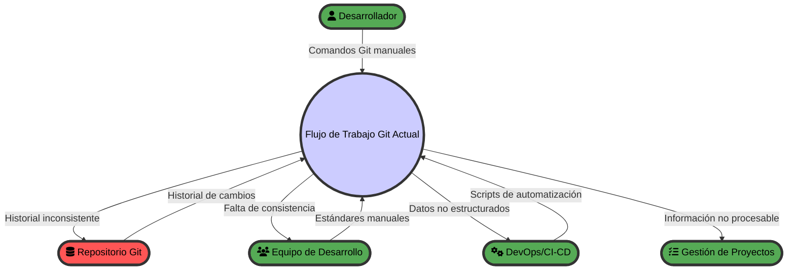
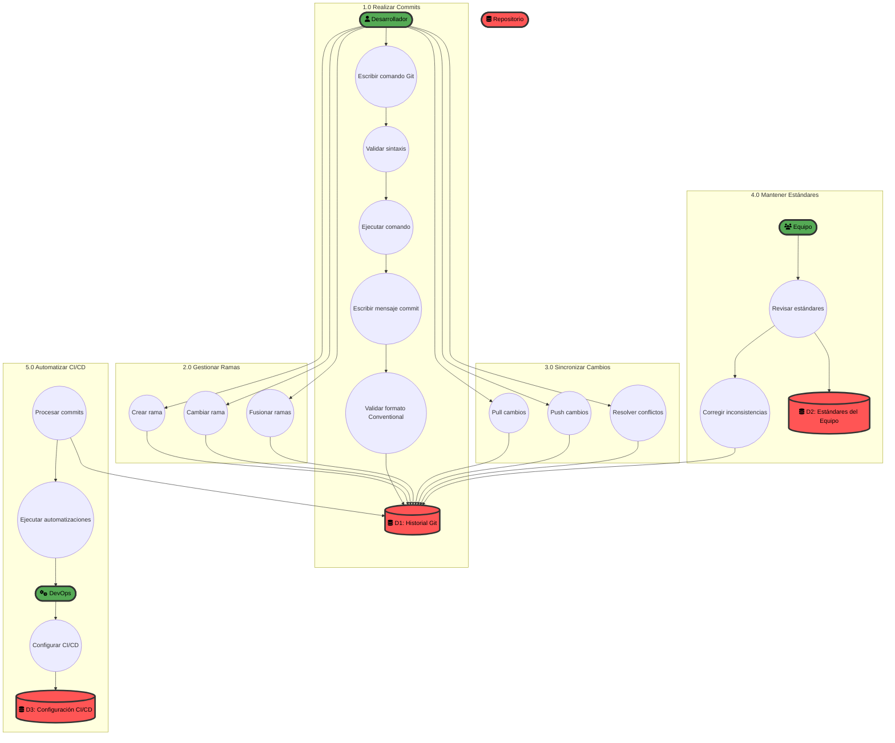

# [research-and-assessment-of-the-problem] - ggGit

> Este documento debe ser una continuación del documento de contexto del proyecto. Consiste en una descripción detallada de los procesos del problema actual que se busca resolver con la solución de software, los actores involucrados y las integraciones con otros sistemas. No busca aportar soluciones, sino describir el problema tal como es. Invita a los diseñadores de producto a entender el problema, generar actividades de investigación y relevamiento de forma proactiva e iterativamente. Se trata de un documento que debe ser leído por todos los miembros del equipo de producto. Debe estar enfocado en la comprensión del problema, la identificación de los factores que lo afectan.
> El documento completo será la base para la generación y discusión iterativa de soluciones de software.

## 📋 Tabla de Contenidos <!-- omit in toc -->

- [Introducción al problema](#introducción-al-problema)
- [👥 Actores](#-actores)
  - [Diagrama de Flujo de Datos del problema de Nivel 0](#diagrama-de-flujo-de-datos-del-problema-de-nivel-0)
- [⚙️ Procesos del problema](#️-procesos-del-problema)
  - [Diagrama de Flujo de Datos del problema de Nivel 1](#diagrama-de-flujo-de-datos-del-problema-de-nivel-1)
- [🔍 Flujos detallados de procesos del problema seleccionados](#-flujos-detallados-de-procesos-del-problema-seleccionados)
- [🔗 Integraciones con otros sistemas](#-integraciones-con-otros-sistemas)
- [🌐 Entorno de Implementación](#-entorno-de-implementación)

## Introducción al problema

El problema que enfrentan los desarrolladores y equipos de desarrollo es la ineficiencia y la falta de consistencia en el uso de Git, especialmente en lo que respecta a la implementación de Conventional Commits. Los procesos actuales de trabajo con Git son manuales, propensos a errores y requieren un conocimiento técnico profundo que no todos los miembros del equipo poseen.

Los flujos de trabajo actuales se basan en comandos Git nativos que son verbosos, difíciles de recordar y no proporcionan validaciones automáticas para mantener la consistencia en los mensajes de commit. Esto resulta en un historial de Git fragmentado, dificulta la automatización de procesos de CI/CD y genera fricción en el flujo de trabajo diario de los desarrolladores.

El problema se manifiesta en múltiples niveles: desde el desarrollador individual que pierde tiempo escribiendo comandos largos, hasta equipos completos que no pueden implementar estándares de commit consistentes, y organizaciones que no pueden automatizar procesos basados en el historial de Git debido a la falta de estructura en los mensajes.

Un factor adicional crítico es la **resistencia cultural y técnica a la consola** que existe en muchos equipos de desarrollo. Esta resistencia se manifiesta especialmente en desarrolladores que provienen de entornos donde las herramientas gráficas son la norma, o en equipos que han adoptado Git recientemente y no tienen la familiaridad histórica con terminales. Esta barrera cultural afecta significativamente la adopción de herramientas basadas en línea de comandos, incluso cuando estas herramientas resuelven problemas reales de productividad.

## 👥 Actores

### Desarrolladores Individuales
**Tipo**: Actor interno principal  
**Responsabilidades**: Realizar commits, gestionar ramas, sincronizar cambios  
**Restricciones**: Deben recordar sintaxis Git compleja, mantener consistencia en mensajes  
**Capacidades**: Conocimiento técnico variable, acceso a terminal/IDE  

### Líderes Técnicos / Tech Leads
**Tipo**: Actor interno  
**Responsabilidades**: Establecer estándares de equipo, revisar código, mantener calidad  
**Restricciones**: Dependen de que el equipo siga estándares manualmente  
**Capacidades**: Conocimiento técnico avanzado, autoridad para establecer procesos  

### DevOps / Ingenieros de Plataforma
**Tipo**: Actor interno  
**Responsabilidades**: Automatizar procesos CI/CD, gestionar despliegues  
**Restricciones**: No pueden confiar en la estructura de mensajes de commit  
**Capacidades**: Acceso a sistemas de CI/CD, scripting avanzado  

### Equipos de Desarrollo
**Tipo**: Actor interno colectivo  
**Responsabilidades**: Colaborar en repositorios compartidos, mantener consistencia  
**Restricciones**: Diferentes niveles de experiencia, falta de estándares unificados  
**Capacidades**: Acceso a repositorios, diferentes entornos de desarrollo  

### Sistemas de CI/CD
**Tipo**: Actor interno técnico  
**Responsabilidades**: Automatizar builds, tests, despliegues  
**Restricciones**: Dependen de mensajes de commit estructurados  
**Capacidades**: Acceso a repositorios Git, ejecución de scripts  

### Repositorios Git Remotos
**Tipo**: Actor externo técnico  
**Responsabilidades**: Almacenar código, historial de cambios  
**Restricciones**: No validan estructura de mensajes automáticamente  
**Capacidades**: API Git, webhooks, integraciones  

### Sistemas de Gestión de Proyectos
**Tipo**: Actor externo  
**Responsabilidades**: Seguimiento de tareas, releases, documentación  
**Restricciones**: No pueden extraer información estructurada de commits  
**Capacidades**: Integraciones con Git, APIs de gestión

### Desarrolladores Resistentes a la Consola
**Tipo**: Actor interno  
**Responsabilidades**: Desarrollar código, colaborar en repositorios  
**Restricciones**: Prefieren herramientas gráficas, resistencia a comandos de terminal  
**Capacidades**: Conocimiento de Git básico, familiaridad con IDEs gráficos  
**Características especiales**: Representan un segmento significativo del mercado objetivo, especialmente en equipos que adoptaron Git recientemente o en organizaciones con cultura de herramientas visuales  

### Diagrama de Flujo de Datos del problema de Nivel 0

## ⚙️ Procesos del problema

### Proceso 1: Realización de Commits
**Descripción**: El desarrollador debe escribir manualmente comandos Git completos y mensajes de commit siguiendo estándares de Conventional Commits  
**Puntos de dolor**: Comandos verbosos, sintaxis compleja, falta de validación automática  
**Frecuencia**: Múltiples veces por día por desarrollador  

### Proceso 2: Gestión de Ramas
**Descripción**: Creación, cambio y fusión de ramas usando comandos Git nativos  
**Puntos de dolor**: Comandos largos, falta de convenciones de nomenclatura  
**Frecuencia**: Varias veces por semana por desarrollador  

### Proceso 3: Sincronización con Repositorio Remoto
**Descripción**: Pull, push y resolución de conflictos usando comandos básicos  
**Puntos de dolor**: Comandos separados, falta de feedback visual claro  
**Frecuencia**: Múltiples veces por día por desarrollador  

### Proceso 4: Implementación de Estándares de Equipo
**Descripción**: Los líderes técnicos deben verificar manualmente que el equipo siga los estándares de Conventional Commits  
**Puntos de dolor**: Revisión manual, falta de validación automática, inconsistencias  
**Frecuencia**: En cada revisión de código  

### Proceso 5: Automatización de CI/CD
**Descripción**: Los ingenieros DevOps intentan automatizar procesos basándose en mensajes de commit  
**Puntos de dolor**: Mensajes no estructurados, falta de metadatos consistentes  
**Frecuencia**: Durante la configuración y mantenimiento de pipelines

### Proceso 6: Adopción de Herramientas de Línea de Comandos
**Descripción**: Los equipos intentan adoptar herramientas basadas en terminal para mejorar la productividad  
**Puntos de dolor**: Resistencia cultural a la consola, curva de aprendizaje empinada, falta de familiaridad con terminales  
**Frecuencia**: Durante la introducción de nuevas herramientas o estándares de equipo  

### Diagrama de Flujo de Datos del problema de Nivel 1

## 🔍 Flujos detallados de procesos del problema seleccionados

### Flujo 1: Proceso de Commit con Conventional Commits

**Descripción**: Un desarrollador intenta realizar un commit siguiendo los estándares de Conventional Commits del equipo.

**Pasos del proceso actual**:
1. El desarrollador prepara cambios en su área de staging
2. Debe recordar la sintaxis correcta: `git commit -m "type(scope): description"`
3. Escribe manualmente el comando completo
4. Debe recordar los tipos válidos (feat, fix, docs, style, refactor, test, chore)
6. Debe recordar el formato del scope y la descripción
7. Ejecuta el comando
8. Si hay error de sintaxis, debe corregir y reintentar
9. El commit se registra en el historial

**Puntos de dolor identificados**:
- **Memorización**: Debe recordar sintaxis compleja
- **Validación manual**: No hay verificación automática del formato
- **Reintentos**: Errores de sintaxis requieren corrección manual
- **Inconsistencia**: Diferentes desarrolladores pueden usar formatos ligeramente diferentes

### Flujo 2: Gestión de Ramas y Sincronización

**Descripción**: Un desarrollador necesita cambiar de rama, sincronizar cambios y crear una nueva rama para una feature.

**Pasos del proceso actual**:
1. Verifica el estado actual: `git status`
2. Guarda cambios pendientes: `git stash` (si es necesario)
3. Cambia a la rama principal: `git checkout main` o `git checkout master`
4. Actualiza la rama principal: `git pull origin main`
5. Crea nueva rama: `git checkout -b feature/nueva-funcionalidad`
6. Aplica cambios guardados: `git stash pop` (si es necesario)
7. Continúa trabajando en la nueva rama

**Puntos de dolor identificados**:
- **Comandos múltiples**: Cada operación requiere un comando separado
- **Falta de feedback**: No hay indicación visual clara del estado
- **Secuencia compleja**: Debe recordar el orden correcto de operaciones
- **Gestión de stash**: Manejo manual de cambios pendientes

### Flujo 3: Revisión de Estándares de Equipo

**Descripción**: Un líder técnico revisa que el equipo esté siguiendo los estándares de Conventional Commits.

**Pasos del proceso actual**:
1. Revisa el historial de commits recientes: `git log --oneline -10`
2. Analiza manualmente cada mensaje de commit
3. Identifica mensajes que no siguen el estándar
4. Documenta las inconsistencias encontradas
5. Comunica las correcciones necesarias al equipo
6. Espera que los desarrolladores corrijan manualmente
7. Verifica nuevamente en la siguiente revisión

**Puntos de dolor identificados**:
- **Revisión manual**: No hay validación automática
- **Tiempo consumido**: Revisar cada commit individualmente
- **Inconsistencias persistentes**: Los errores se repiten
- **Falta de métricas**: No hay forma de medir el cumplimiento

### Flujo 4: Proceso de Adopción de Herramientas de Terminal

**Descripción**: Un equipo intenta adoptar herramientas basadas en línea de comandos para mejorar su flujo de trabajo con Git.

**Pasos del proceso actual**:
1. El líder técnico identifica la necesidad de mejorar la productividad con Git
2. Investiga herramientas disponibles y encuentra ggGit o similares
3. Propone la adopción al equipo
4. Encuentra resistencia de desarrolladores acostumbrados a herramientas gráficas
5. Debe justificar el cambio cultural y técnico
6. Implementa un período de transición con capacitación
7. Enfrenta rechazo de desarrolladores que prefieren mantener su flujo actual
8. Debe demostrar beneficios tangibles para mantener la adopción
9. Gestiona la curva de aprendizaje de diferentes niveles de experiencia

**Puntos de dolor identificados**:
- **Resistencia cultural**: Preferencia por herramientas visuales establecidas
- **Curva de aprendizaje**: Diferentes niveles de familiaridad con terminales
- **Justificación del cambio**: Necesidad de demostrar ROI claro
- **Gestión de transición**: Período de adaptación que puede afectar productividad
- **Fragilidad de adopción**: Herramientas pueden ser abandonadas si no hay beneficios inmediatos visibles

## 🔗 Integraciones con otros sistemas

### Sistema de Control de Versiones Git
**Propósito**: Almacenar y gestionar el historial de cambios del código  
**Tipo de datos**: Commits, ramas, tags, historial de cambios  
**Método de comunicación**: Comandos Git nativos, API Git  
**Estado actual**: Funcionando, pero con limitaciones en la estructura de datos  

### Sistemas de CI/CD (Jenkins, GitHub Actions, GitLab CI)
**Propósito**: Automatizar builds, tests y despliegues basándose en cambios  
**Tipo de datos**: Mensajes de commit, metadatos de cambios  
**Método de comunicación**: Webhooks, API de repositorios  
**Estado actual**: Limitado por la falta de estructura en mensajes de commit  

### Herramientas de Gestión de Proyectos (Jira, GitHub Issues, GitLab Issues)
**Propósito**: Vincular cambios de código con tareas y tickets  
**Tipo de datos**: Referencias a issues, tipos de cambio  
**Método de comunicación**: Integraciones API, parsing de mensajes  
**Estado actual**: Requiere parsing manual de mensajes no estructurados  

### Sistemas de Documentación Automática
**Propósito**: Generar changelogs y documentación de releases  
**Tipo de datos**: Historial de cambios, tipos de features/fixes  
**Método de comunicación**: Parsing de mensajes de commit  
**Estado actual**: Difícil de implementar sin estructura consistente  

### Herramientas de Análisis de Código
**Propósito**: Analizar patrones de desarrollo y métricas del equipo  
**Tipo de datos**: Frecuencia de commits, tipos de cambios  
**Método de comunicación**: Análisis del historial Git  
**Estado actual**: Limitado por la falta de metadatos estructurados

### Herramientas de Gestión de Cambio Organizacional
**Propósito**: Facilitar la adopción de nuevas herramientas y procesos en equipos de desarrollo  
**Tipo de datos**: Métricas de adopción, feedback de usuarios, ROI de herramientas  
**Método de comunicación**: Encuestas, análisis de uso, métricas de productividad  
**Estado actual**: Limitado por la falta de herramientas que faciliten la transición desde entornos gráficos  

## 🌐 Entorno de Implementación

### Entornos de Desarrollo
**Sistemas Operativos**: Linux (Ubuntu, CentOS, RHEL), macOS, Windows  
**Shells**: Bash (Linux/macOS), PowerShell (Windows), Zsh (macOS)  
**IDEs**: VSCode, IntelliJ, Eclipse, Vim, Emacs  
**Terminales**: Terminal nativo, iTerm2, Windows Terminal, WSL  
**Contexto Organizacional**: Infraestructura de desarrollo de Novafuria, equipos de trabajo existentes  

### Infraestructura Git
**Repositorios**: GitHub, GitLab, Bitbucket, repositorios privados  
**Protocolos**: HTTPS, SSH, Git  
**Autenticación**: Tokens de acceso personal, claves SSH, credenciales de usuario  
**Almacenamiento**: Local (cliente), remoto (servidor), espejos  

### Sistemas de Integración
**CI/CD**: Jenkins, GitHub Actions, GitLab CI, Azure DevOps, CircleCI  
**Contenedores**: Docker, Kubernetes  
**Cloud**: AWS, Azure, GCP, on-premise  
**Redes**: Internet, redes corporativas, VPNs  

### Restricciones Técnicas
**Permisos**: Usuarios con acceso limitado a sistemas  
**Firewalls**: Restricciones de red en entornos corporativos  
**Políticas de seguridad**: Requisitos de autenticación y autorización  
**Compliance**: Cumplimiento de estándares de la industria  

### Dependencias del Sistema
**Git**: Versión mínima 2.0+  
**Shell**: Bash 4.0+ o PowerShell 5.0+  
**Sistema de archivos**: Permisos de lectura/ejecución en directorios  
**Variables de entorno**: Acceso a PATH y configuración del shell
